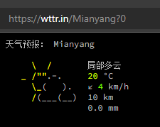
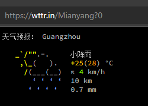

# 作业 HTTP的通信监控和回放

部署类似Microsoft PetshopWeb 应用基本实例，开发性能测试小工具能截获基于IE浏览器与Web服务器交互的数据报，修改数据包（比如简化起见，修改要搜索的关键字），再把修改后的内容使用多线程的方式发送到服务器。统计请求每个网页上主要元素（gif, css等）需要的时间，以及请求整个网页的时间。

提示：
1. 在获取数据包的过程中要根据HTTP请求的特点，从原始的数据包中过滤出HTTP的数据包，找到提交的“搜索的关键字”，将其替换成其他字符
2. 发送数据包使用Socket，可以参考网络编程的资料

# 实现

本例测试网站为 [https://wttr.in/Mianyang?0](https://wttr.in/Mianyang?0)

该网站 host 为 _wttr.in_ 使用GET方法请求，请求的URL为 **_{location}?0_**

## 功能

本例使用 netty 框架，建立代理服务器，截获浏览器与服务器之间的http报文，并修改GET请求的URL，达到目的。

其具体效果如下图所示：

启动代理服务器前：请求绵阳天气，返回绵阳的天气信息




启动代理服务器后：请求绵阳天气，返回广州的天气信息



## 目录结构

```
.
├─src   //源代码根目录
│  ├─main   //代码目录                                      
│  │  ├─java 
│  │  │  │  HttpProxyServer.java    //服务器启动代码
│  │  │  │ 
│  │  │  ├─bean   //bean目录
│  │  │  │      ClientRequest.java    //保存http报文主要信息
│  │  │  │      Const.java  //存放静态常量
│  │  │  │
│  │  │  └─handler  //存放报文处理代码
│  │  │      ├─edit  //存放修改报文代码
│  │  │      │      Editor.java  //修改报文的类
│  │  │      │
│  │  │      ├─proxy  //代理处理代码
│  │  │      │      HttpProxyHandler.java  //http代理
│  │  │      │      HttpsProxyHandler.java  //https代理
│  │  │      │      IProxyHandler.java  //http、https的处理方法接口
│  │  │      │      SocksProxyHandler.java  //socks代理
│  │  │      │
│  │  │      ├─response  //处理response报文
│  │  │      │      HttpProxyResponseHandler.java  //http response处理
│  │  │      │      SocksResponseHandler.java  //socks response处理
│  │  │      │
│  │  │      └─utils  //存放功能代码
│  │  │              HttpsSupport.java  //对https报文解析提供支持
│  │  │              ProxyRequestUtil.java  //获取代理的request请求
│  │  │
│  │  └─resources //资源目录，openssl证书，用于https的数据解析
│  │          ca.crt
│  │          ca.key
│  │          ca_private.der
│  │
│  └─test //测试目录
│      └─java
│              Start.java  //测试代码
```

## 流程

```flow
start1=>start: 客户端请求
op1=>operation: 解码、编码
op2=>operation: HttpProxyHandler代理Http请求
op3=>operation: HttpsProxyHandler代理Https请求
cond1=>condition: 是否为http报文
cond2=>condition: 是否为https报文
op4=>operation: SocksProxyHandler代理Socks
end3=>end: Editor篡改请求报文，并发送

end1=>end: 全部转发（不做处理）
end2=>end: 结束
start1->op1->cond1
cond1(yes)->op2
cond1(no)->cond2
cond2(yes)->op3->end3
cond2(no)->op4->end1

```